# PLAN — ais-sentinel

*Maritime domain awareness from public AIS data: tracking, trajectory prediction with
uncertainty, and anomaly detection, with a static web front end.*

Planning date: 2026-10-05. Research notes, with sources, are in [docs/RESEARCH.md](docs/RESEARCH.md).
Each claim below cites a numbered source (e.g. **[S3]**), listed in §12.

---

## 1. Goals

1. **Tracking:** turn noisy, irregular AIS position reports into smooth tracks with
   calibrated uncertainty. Use a constant-velocity Kalman filter (CV-KF) and an
   Interacting Multiple Model (IMM) filter with stationary, cruising and turning modes.
2. **Prediction:** forecast positions at 15, 30, 60 and 120 minutes, with uncertainty.
   Compare physics baselines and ML sequence models fairly, on the same locked test set.
3. **Anomaly detection:** flag AIS gaps ("going dark"), kinematically impossible jumps,
   loitering, route deviation and vessel-to-vessel rendezvous. Each flag carries a
   human-readable explanation.
4. **System quality:** a reproducible pipeline (one command), a tested and typed Python
   package, CI, and a polished static website on GitHub Pages.
5. **Honesty:** set targets before seeing test results, and report wins and losses equally.

## 2. Scope and non-goals

**In scope**
- One region and one six-month window of MarineCadastre AIS (see §3).
- Offline batch processing: the site shows precomputed results.
- CPU-only models that each train in under about 30 minutes on a 4-core laptop
  (no CUDA GPU on the dev machine).

**Non-goals**
- Real-time streaming ingestion, or any live AIS feed.
- Satellite AIS, radar or imagery fusion. The project is single-sensor.
- Vessel identity resolution: MMSI is taken as the identity. Spoofed identities are
  out of scope; only kinematic spoofing symptoms are in scope.
- Claims about real-world intent. Anomalies are *flags for an analyst*, not accusations.
- Global or multi-region models. A second region (Danish DMA data) is a stretch goal for
  a cross-region sanity check only.
- A large transformer. A *small* transformer is included only if time allows (Phase 5c).

## 3. Data

### 3.1 Sources

| Source | Contents | Coverage | Size | Access | Licence | Use here |
|---|---|---|---|---|---|---|
| **MarineCadastre / NOAA OCM "Vessel Traffic" AIS** [S1][S2][S3] | Point reports: MMSI, BaseDateTime (UTC), LAT, LON, SOG, COG, Heading, name, IMO, call sign, VesselType, Status, Length, Width, Draft, Cargo, TransceiverClass | US EEZ and Great Lakes from USCG NAIS terrestrial receivers. 2009–2014 monthly by UTM zone; 2015 onward daily nationwide. Downsampled to 1 report per minute per vessel | About 300–335 MB zipped / about 0.9 GB CSV per day, about 8.3 M rows/day nationally (measured 2023-06-15) | HTTPS: `coast.noaa.gov/htdata/CMSP/AISDataHandler/YYYY/AIS_YYYY_MM_DD.zip` (≤2023). 2024+ via Azure blob `csv2/*.csv.zst` or GeoParquet | **CC0 1.0** (public domain), NOAA "as-is" disclaimer; attribution requested | **Primary** |
| AccessAIS [S1] | Custom area/time extracts of the same data | Same | ≤ about 2 GB per order | Web form | Same | Not used (manual; we automate the bulk path instead) |
| Danish Maritime Authority [S4] | Raw, unfiltered AIS, daily CSV | Danish waters, 2006 to present | 580–755 MB zipped per day | S3 bucket over HTTP | Free under Danish PSI rules; no named licence; no identification of persons | Stretch: cross-region check. Not redistributed |
| Kystverket (Norway) [S5] | AIS positions | Norway, within 12 nm, ships > 45 m | — | Download service | NLOD 2.0 | Not used (noted as an alternative) |
| Global Fishing Watch [S6] | Derived events (encounters, loitering, gaps) | Global | API | Token; **CC BY-NC 4.0** | Not used, but its event *definitions* inform our thresholds |
| AISHub [S7] | Real-time only | — | — | Must contribute a receiver feed | — | Not usable (no receiver) |

Canadian open data (DFO) offers only vessel *density rasters*, not raw tracks **[S8]**, so
Canadian traffic in our region comes from US receivers' coverage of the shared waterways.

**Data-quality issues to handle** (measured on 2023 files or documented)
- Heading = 511 ("not available") in about 52% of rows.
- SOG ≥ 102.3 (not available) in about 0.3% of rows.
- COG = 360 (not available).
- Invalid MMSIs (not 9 digits; MID outside 201–775).
- Duplicate (MMSI, time) rows.
- Positions off the waterway, from GPS errors or multiple vessels sharing one MMSI.
- Timestamps without a time-zone suffix. They are documented as UTC **[S2]**.
- One-minute downsampling, which caps the effective rate below the native AIS rate of
  2–10 s for Class A ships underway **[S9]**.

### 3.2 Region and time window — decision

**Region: Detroit–St. Clair corridor, AOI = 41.40–43.10 °N, 83.60–82.30 °W.**
The box covers Lake Huron's outlet at Port Huron/Sarnia, the St. Clair River, Lake St. Clair,
the Detroit River (Windsor–Detroit) and western Lake Erie.

Why this region:
- **Canadian relevance.** It is one of the busiest Canada–US border waterways.
  Canadian lakers (MMSI prefix 316) appear in the data.
- **Interesting dynamics.** Narrow, curving dredged channels make dead reckoning fail at
  bends, which is where learned route knowledge should help. Lake St. Clair and Lake Erie
  give open-water segments, and docks and anchorages give stationary behaviour.
- **Laptop-sized.** The research measurement **[S10]** found 92 distinct vessels in this
  box within 30 minutes. That scales to an estimated **about 57 k rows/day, or about
  1.7 M rows/month** (0.69% of national rows). Six months is about **10 M rows**: under
  about 200 MB as Parquet, and it fits in 16 GB RAM.
- **Rejected alternative: Strait of Juan de Fuca / Puget Sound.** It is richer, at about
  775 k rows/day, but about 14× larger, and it lacks the Canadian Great Lakes angle.
  The St. Lawrence Seaway was rejected because US-side coverage is thin (7 vessels in 30
  minutes).

**Window: 2023-05-01 to 2023-10-31 (UTC), six months of the open navigation season.**
- 2023 has verified working legacy zip URLs.
- The 2024 legacy URLs return 404, and the 2024+ formats changed schema.
- The ingest layer normalises both schemas, so extending to 2024/2025 later is a config change.
- Winter is excluded because the Soo Locks and Seaway close (about mid-January to late
  March), which would make seasonal patterns non-stationary.

**Download cost:**
- 184 daily national files at about 320 MB each is about 59 GB of transfer.
- At about 5 MB/s measured, that is about 3.5 h.
- Files download one at a time with a pause between them. Each file is filtered to the
  AOI in streaming fashion and the national file is then deleted, so peak disk use is
  about 1.3 GB (the dev machine has about 32 GB free).
- Re-runs are skipped through a per-day manifest.

### 3.3 Splits (time-based, voyage-disjoint)

| Split | Dates (UTC) | Use |
|---|---|---|
| train | 2023-05-01 – 2023-08-31 | Fit models, build route and traffic statistics |
| buffer | 2023-09-01 | Dropped |
| validation | 2023-09-02 – 2023-09-30 | Tuning, early stopping, conformal calibration |
| buffer | 2023-10-01 | Dropped |
| **locked test** | **2023-10-02 – 2023-10-31** | Evaluated once per completed model version, logged in `reports/holdout_runs.md` |

- A **voyage** is a contiguous segment of one MMSI with no gap over 30 minutes.
- Each voyage is assigned to the split containing its *whole* time span. Voyages that cross
  a boundary are dropped, and the one-day buffers make that rare. Leakage tests enforce
  both rules.
- **Same vessel, different voyages.** A vessel can appear in more than one split (lakers
  repeat routes), which a recent leakage study shows can flatter results **[S16]**. We
  therefore also report test metrics on the **vessel-unseen subset**: test voyages whose
  MMSI never appears in train.
- Route statistics and the nearest-neighbour library are built from **train only**.

## 4. Architecture

```mermaid
flowchart LR
  subgraph Data["ais_sentinel.data"]
    D1[download<br/>rate-limited, manifest] --> D2[ingest<br/>stream filter to AOI]
    D2 --> D3[clean<br/>sentinels, dedupe, MMSI, speed gate]
    D3 --> D4[segment<br/>voyages, splits]
  end
  subgraph Track["ais_sentinel.tracking"]
    T1[CV Kalman filter]
    T2[IMM: stationary / CV / CT-EKF]
    T3[RTS smoother]
    T4[simulator + NEES/NIS]
  end
  subgraph Pred["ais_sentinel.prediction"]
    P1[dead reckoning]
    P2[KF/IMM extrapolation]
    P3[historical kNN routes]
    P4[GRU Gaussian / MDN]
    P5[small transformer - stretch]
  end
  subgraph Anom["ais_sentinel.anomaly"]
    A1[gaps] & A2[kinematic jumps] & A3[loitering] & A4[route deviation] & A5[rendezvous]
    A6[synthetic injection]
  end
  subgraph Eval["ais_sentinel.evaluation"]
    E1[metrics + bootstrap CIs]
    E2[reports/*.md, figures]
  end
  subgraph Web["ais_sentinel.export → site/"]
    W1[compact JSON extracts] --> W2[Vite + TS + MapLibre]
    W2 --> W3[GitHub Pages]
  end
  D4 --> Track --> Pred
  Track --> Anom
  Pred --> Eval
  Anom --> Eval
  Eval --> Web
  Track --> Web
```



**Configuration and reproducibility**
- Every stage reads `configs/default.yaml`.
- One entry point, `ais-sentinel <stage>`, provides `run-all` plus the individual stages:
  `download`, `ingest`, `segment`, `track`, `train`, `evaluate`, `detect` and `export`.
- Seeds are set in config, and every artifact records its config hash.

**Coordinates**
- All filtering and prediction run in a local East-North-Up (ENU) tangent plane, built via
  ECEF from WGS84 (exact formulas, no projection library).
- Each track's frame is anchored at its first fix, and each prediction sample's frame is
  anchored at its last observed fix.
- Errors are reported as **haversine distance in km**, with nautical miles shown alongside.
- All timestamps are timezone-aware UTC.

## 5. Modelling approach

### 5.1 Tracking

**State and measurements**
- State is x = [e, n, vₑ, vₙ, ω], in metres, m/s and rad/s.
- The measurement is position (e, n). Optionally SOG/COG are added as a velocity
  measurement; the simulation (§6.1) decides whether to keep it.

**Models**
- **CV-KF:** nearly-constant-velocity (white-noise acceleration) model **[S11]**. The
  discretisation depends on dt, which handles irregular sampling.
- **IMM** with three modes sharing the 5-D state (the standard augmented-state IMM **[S11]**):
  1. *Stationary:* velocity decays strongly towards 0, with tiny process noise. For moored
     or anchored ships and GPS jitter.
  2. *Cruising:* CV with small acceleration noise (q ≈ 0.01–0.05 m²/s³ **[S12]**), ω held
     at 0.
  3. *Turning:* coordinated-turn model with turn rate in the state, propagated with an
     **EKF** (the CT model is nonlinear), with ω noise around 0.1–1 °/s.
  - The Markov transition matrix depends on dt: p_stay = exp(−dt/τ_mode).
  - A UKF variant of the CT mode is optional. It is kept only if the simulation shows a
    measurable gain over the EKF.

**Gaps and outliers**
- Gaps over 30 minutes end the track: a new voyage starts.
- Outliers are rejected by χ² gating on the innovation, discarding the fix when
  NIS > χ²₂(0.999) = 13.8.
- After 3 consecutive rejections the filter re-initialises from the latest fixes. This
  handles real jumps as well as track swaps.
- Rejected points become *kinematic anomaly candidates* (§5.3).

**Smoothing:** a Rauch–Tung–Striebel (RTS) smoother for the CV-KF, and IMM smoothing via
per-mode RTS with mode-probability weighting (approximate). Smoothed tracks feed the
anomaly detectors and the site; *filtered* (causal) states feed prediction, so no future
data leaks into a forecast.

**Tuning:** q and the mode parameters are fit on *simulated* data (§6.1) and the
**training** split only. Consistency on real data is checked using NIS on the validation
split.

### 5.2 Prediction

**Setup**
- **Samples:** taken at anchor times every 10 minutes inside each voyage. Each needs
  ≥ 60 min of history, and enough future to cover the horizon being scored.
- **Inputs:** the last 60 minutes resampled to a 1-minute grid. Gaps up to 5 minutes are
  linearly interpolated, and samples with larger history gaps are dropped.
- **Features:** ENU positions relative to the last fix, SOG, COG (as sin/cos), Δt since the
  last real fix, vessel type group, length, and the CV-KF filtered velocity.
- **Targets:** displacement at +15, +30, +60 and +120 min, in the local ENU frame of the
  last fix. Metrics are computed at every available horizon.

**Models (all output a mean plus a 2-D Gaussian covariance per horizon)**

| ID | Model | Uncertainty |
|---|---|---|
| B0 | Dead reckoning from the last reported SOG/COG | Error covariance grows with horizon, fit on train residuals (σ(h) per horizon and axis) |
| B1 | CV-KF extrapolation from the filtered state | KF predicted covariance, then variance-scaled on validation |
| B2 | IMM extrapolation (mode-mixture prediction) | Moment-matched IMM covariance, then variance-scaled on validation |
| B3 | **Historical kNN route:** find the k nearest train-split states in (position, course, speed) space, average their future displacements rotated into the query's heading | Weighted sample covariance of the neighbours' futures |
| M1 | **GRU encoder → direct multi-horizon head**, outputs mean plus Cholesky of a 2×2 covariance, trained with Gaussian NLL | Aleatoric uncertainty, from the network; plus a 5-seed deep ensemble for epistemic uncertainty |
| M2 | M1 with a 3-component mixture density head (multi-modal, e.g. at forks) | Mixture |
| M3 | Small transformer encoder (stretch) | As M1 |

**Calibration:** each model's covariance gets one scalar variance scale per horizon, fit on
validation. This is a simple, honest conformal-style step **[S13]**.

**Training budget:** an hour-scale CPU budget. The GRU is about 50–200 k parameters, so we
expect about 10⁵–10⁶ training samples.

**Browser demo (stretch):** export M1 to ONNX (opset 17) and run it with
onnxruntime-web/wasm on a single thread. GitHub Pages cannot set the COOP/COEP headers
needed for threads **[S14]**.

### 5.3 Anomaly detection (rules first, each with an explanation string)

| Type | Rule (default, configurable) | Grounding |
|---|---|---|
| **AIS gap / going dark** | A moving vessel (SOG > 1 kn) goes silent for ≥ 30 min while (a) inside the AOI, more than 3 km from the AOI edge at both ends, and (b) in cells whose empirical reception rate is ≥ 80%. Score = gap length × reception rate | GFW uses ≥ 12 h offshore with satellite reception modelling **[S15]**. Our terrestrial 1-min data justifies a much shorter threshold, and the reception mask plays the same role as GFW's reception filter |
| **Kinematic jump (spoofing or data error)** | Implied speed between consecutive fixes > max(40 kn, 2 × reported SOG + 10 kn), *or* the filter's NIS > χ²₂(0.9999) with the point rejected by the gate | The 40 kn implied-speed cap follows TrAISformer preprocessing **[S16]** |
| **Loitering** | Mean SOG < 2 kn for ≥ 2 h, *outside* port/anchorage zones learned from train data (DBSCAN on long-stationary fixes, plus a 500 m buffer) | GFW loitering uses < 2 kn **[S17]**; duration shortened for inland waters |
| **Route deviation** | A 500 m grid traffic model from train: per-cell visit density, plus a per-cell course histogram (12 bins). Flag ≥ 10 min of consecutive fixes in cells below the 1st percentile of density, or with course probability < 0.02 (wrong-way) | Inspired by TREAD/GeoTrackNet **[S18][S19]**, simplified to an explainable grid model |
| **Rendezvous** | Two vessels within 500 m, both < 2 kn, for ≥ 1 h, outside port/anchorage zones | GFW encounter: 500 m, < 2 kn, ≥ 2 h, ≥ 10 km from anchorage **[S20]**; duration and port distance adapted to inland waters |

Every detection records the type, MMSI, time span, location, the measured values versus
thresholds, and a one-sentence explanation, which the site displays. Example: "Silent for
47 min while moving at 11 kn in an area where 96% of expected reports are normally
received."

## 6. Evaluation design

### 6.1 Tracker validation on simulation (ground truth known)

**Simulator:** generates true trajectories made of straight legs, coordinated turns of
0.05–1.0 °/s (lakers about 0.1–0.3 °/s, tugs faster), speed changes, and stops.

**Measurements** mimic MarineCadastre:
- 60 s nominal interval with ±5 s jitter.
- Random dropouts: 5% of reports, plus occasional 2–20 min bursts.
- GPS noise σ = 5 m per axis, consistent with 10 m at 95% **[S2]**.
- 0.5% outliers of 200 m–5 km.
- SOG noise of 0.1 kn and COG noise of 2°, used when the velocity-measurement option is on.

**Protocol:**
- Tune on seeds 0–49, evaluate on seeds 100–299.
- Report position RMSE overall, on straight segments and on manoeuvre segments.
- Report average NEES against two-sided 95% χ² bounds over Monte Carlo runs **[S11]**.
- Report outlier-rejection precision and recall.

### 6.2 Filter consistency on real data
- Report the NIS distribution on validation voyages and the fraction of NIS values
  exceeding χ²₂(0.95), which is nominally 5%.
- Report time-averaged NIS per voyage.

### 6.3 Prediction

**Error metrics** (haversine, km), at each horizon h ∈ {15, 30, 60, 120} min:
- mean error and median error;
- final-displacement error.

**Probabilistic metrics:**
- Gaussian NLL.
- Empirical coverage of the 50% and 90% ellipses (radius² = χ²₂ quantile).
- Mean 90% ellipse area, as sharpness.

**Confidence intervals:**
- 95% **cluster bootstrap over voyages** (1,000 resamples), because samples within a
  voyage are correlated.
- Paired bootstrap of the *difference* to the best baseline, which is what decides "beats".

**Breakdowns:**
- vessel group (cargo, tanker, passenger, tug/tow, fishing, pleasure/sailing, other);
- horizon;
- straight versus manoeuvring futures (heading change > 20° within the horizon);
- the vessel-unseen subset.

**Realistic ranges from the literature** (open-water Danish and US Gulf AIS, deterministic
decoding):
- CV at 1 h: 2.8–3.6 km. CV at 2 h: about 9.5 km.
- Deterministic ML at 1 h: about 1.0–2.2 km. At 2 h: about 5 km **[S16][S21][S22]**.
- Published "best-of-N" numbers (e.g. TrAISformer, 0.9 km at 1 h) are oracle metrics, and
  we will not compare against them.
- Our river channels shorten the straight runs. We therefore expect larger CV errors at
  ≥ 60 min and a larger ML gain.

**Locked test:** run once per completed model version (B0–B3, M1, M2, …). Each run is
appended to `reports/holdout_runs.md` with its git hash, config hash and date.

### 6.4 Anomaly detection
- **Synthetic injection with known ground truth** into real *test-period* voyages, at
  ≥ 300 injections per type, at several magnitudes:
  - **gap:** delete 30–180 min of reports;
  - **jump:** displace 1–20 fixes by 1–30 km, with optional return;
  - **loiter:** replace a 2–6 h stretch with a drifting low-speed random walk away from
    ports;
  - **route deviation:** add a smooth lateral offset of 0.5–5 km for 15–60 min;
  - **rendezvous:** synthesise a second vessel that converges, stays within 500 m at
    < 2 kn for 1–3 h, then diverges.
- **Scoring:**
  - A detection matches an injection when its time span overlaps the injected span by
    ≥ 50%, on the same MMSI (or MMSI pair).
  - **Recall** = matched injections / injections.
  - **Precision** = matched detections / (detections on the injected track that were *not*
    already present on the original track).
  - The **base alarm rate** on unmodified real data (alarms per 1,000 vessel-hours) is
    reported separately and honestly, since some of those may be real anomalies.
  - Precision and recall are reported by magnitude bucket, which gives detectability
    curves.
- **Case studies:** at least 3 real detections, investigated and written up in
  `reports/case_studies.md` and on the site. Plausible explanations (e.g. receiver
  coverage hole, track swap, a tug assisting) are stated honestly.

## 7. Phased task list (priority order; each item ≈ one focused session)

**Phase 0 — Skeleton** ✅ planned
0.1 Repo, packaging, ruff/mypy/pytest, pre-commit, CI, Pages workflow, README stub, GITHUB_SETUP.

**Phase 1 — Vertical slice (end to end, thin)**
1.1 Downloader with a manifest and rate limiting; streaming AOI filter for 3 sample days.
1.2 Cleaning and voyage segmentation, with data-quality tests.
1.3 CV-KF (with dt-dependent matrices) and property tests.
1.4 B0 dead-reckoning baseline and haversine metrics on the sample days.
1.5 Gap detector (rule only).
1.6 Export JSON and a minimal MapLibre page showing raw versus filtered tracks and gaps.
    Deploy to Pages.

**Phase 2 — Robust data pipeline**
2.1 Full six-month download (background), with resume, a manifest and checksums.
2.2 Schema normaliser (legacy CSV / csv2 / GeoParquet) and vessel-type grouping.
2.3 Split assignment with leakage tests; dataset summary report (`reports/data_summary.md`).

**Phase 3 — Tracking**
3.1 AIS-like trajectory simulator.
3.2 CT-EKF mode and IMM (mixing, mode probabilities, dt-dependent transition matrix).
3.3 Gating, re-initialisation and the RTS smoother.
3.4 Simulation study (RMSE by segment type, NEES) and tuning; `reports/tracking.md`.
3.5 Real-data NIS consistency.

**Phase 4 — Prediction baselines and evaluation harness**
4.1 Sample generator (anchor times, horizons, features), cached to Parquet.
4.2 Metrics, cluster bootstrap and paired-difference CIs, breakdown tables.
4.3 B1/B2 filter extrapolation and B3 kNN route baseline, plus calibration.

**Phase 5 — ML models**
5.1 GRU Gaussian model: training loop, early stopping, seeds, ensemble.
5.2 MDN head.
5.3 (Stretch) small transformer.
5.4 Locked test run for each model; `reports/prediction.md`.

**Phase 6 — Anomaly suite**
6.1 Reception-coverage grid and port/anchorage zones (train split).
6.2 Jump, loitering, route-deviation and rendezvous detectors.
6.3 Synthetic injection framework and evaluation; `reports/anomaly.md`.
6.4 Case studies.

**Phase 7 — Front end**
7.1 Site framework: hash router, layout, styles, dark/light theme, accessibility basics.
7.2 Tracks view: raw/filtered toggle, uncertainty ellipses, time playback.
7.3 Prediction view: model overlays versus truth.
7.4 Anomaly view: list plus map, with explanations.
7.5 Results/methods page with charts. Landing page.
7.6 Playwright tests (desktop and mobile) plus axe checks in CI. Screenshot/GIF for the README.
7.7 (Stretch) ONNX in-browser prediction.

**Phase 8 — Polish:** README results table, limitations, a code-quality review,
coverage, and the final summary in PROGRESS.md.

## 8. Risks and mitigations

| Risk | Likelihood | Mitigation |
|---|---|---|
| Download is slow or unavailable (60 GB total) | Medium | Resumable manifest; the vertical slice needs only 3 days; can reduce the window to 4 months (logged in DECISIONS) |
| Disk space (about 32 GB free) | Medium | Stream-filter and delete each national file immediately; only AOI Parquet is kept (< 1 GB) |
| Region too sparse for ML | Low–Med | About 10 M rows expected; if there are fewer than 50 k training samples, enlarge the AOI to all of Lake Erie / southern Lake Huron (logged) |
| One-minute downsampling hides fast manoeuvres | Certain | Document it; the simulation uses the same 60 s cadence so results transfer |
| Multiple vessels on one MMSI make tracks zig-zag | Medium | Gating plus re-initialisation; flagged as kinematic anomalies; case study |
| Leakage through repeated routes and the same vessels | High | Time split with buffers, voyage-disjoint tests, vessel-unseen subset reported |
| Results too good | Medium | Treated as a bug until disproved: check frames, horizons and split boundaries |
| ML fails to beat kNN/IMM | Medium | A legitimate result; report it honestly |
| WebGL map flaky in headless CI | Medium | Tests wait for MapLibre `idle`; assertions use the DOM/data layer, not pixels |
| Basemap provider (OpenFreeMap) outage | Low | Attribution-compliant; fallback style URL in config; site still renders data layers |
| Privacy (pleasure craft) | — | Showcase only commercial classes; anomaly examples avoid pleasure craft; no vessel names for Class B |

## 9. Success criteria (targets fixed 2026-10-05, before any results)

The project is done when **all** of the following hold. Any revision must be logged in
DECISIONS.md with a reason.

1. **Data pipeline**
   - `ais-sentinel run-all` reproduces the AOI dataset from scratch.
   - The data-quality test suite passes on the processed data, checking:
     - schema and dtypes;
     - UTC timestamps;
     - zero duplicate (MMSI, time) rows;
     - lat/lon inside the AOI;
     - SOG in [0, 102.2], or null;
     - per-voyage monotonic time;
     - zero voyages spanning two splits.
   - Processed rows are ≥ 5 M for the six months (expected about 10 M; the threshold
     guards against silent truncation).
2. **Tracking**
   - **Simulation, manoeuvre segments:** IMM position RMSE is ≥ **20% lower** than the
     best-tuned CV-KF.
   - **Simulation, straight segments:** IMM is no more than **10% worse** than CV-KF.
   - **Simulation, consistency:** IMM average NEES falls within the two-sided 95% χ²
     bounds for ≥ **80%** of time steps.
   - **Real validation data:** the fraction of NIS > χ²₂(0.95) is between **2% and 10%**.
3. **Prediction**
   - Every model (B0–B3, plus ≥ 1 ML model) is evaluated on the locked test at 15, 30, 60
     and 120 min, with voyage-cluster bootstrap 95% CIs.
   - **Target:** the best ML model has a lower mean error than the *best* physics/kNN
     baseline at **60 and 120 min**, with the paired-difference 95% CI excluding 0, and
     an improvement of ≥ **15% at 120 min**.
   - **Calibration target:** for the best ML model, 90% ellipse coverage is within
     **[85%, 95%]** at every horizon on the test set.
   - The result is recorded as met or not met.
4. **Anomaly detection** (synthetic injection, mid-to-large magnitude buckets)

   | Type | Precision | Recall | Magnitude bucket |
   |---|---|---|---|
   | gap | ≥ 0.90 | ≥ 0.90 | gaps ≥ 45 min |
   | jump | ≥ 0.90 | ≥ 0.90 | ≥ 3 km |
   | loiter | ≥ 0.80 | ≥ 0.80 | ≥ 3 h |
   | rendezvous | ≥ 0.80 | ≥ 0.80 | ≥ 1.5 h |
   | route deviation | ≥ 0.70 | ≥ 0.70 | offsets ≥ 1.5 km for ≥ 20 min |

   - The full detectability curves and the base alarm rate are reported.
   - **≥ 3** real-world case studies are documented.
5. **Front end**
   - Deployed on GitHub Pages, with the landing, tracks, prediction, anomaly and
     results/methods views working.
   - Playwright passes at 1280×800 and 390×844.
   - axe reports **0** serious or critical violations on every view.
   - The initial load is ≤ **2 MB** transferred, excluding basemap tiles.
   - The total site is ≤ **50 MB**.
6. **Engineering**
   - CI is green: ruff, mypy and pytest.
   - Line coverage is ≥ **85%** on `data`, `tracking`, `prediction` (non-training code),
     `anomaly` and `evaluation`.
   - The README is complete: summary, screenshot, live link, architecture, results table,
     reproduction steps, limitations, attribution and licence.
7. **Final summary** in plain language at the top of PROGRESS.md.

## 10. Repository layout

```
ais-sentinel/
  src/ais_sentinel/{data,tracking,prediction,anomaly,evaluation,export}/  cli.py, config.py, geo.py
  configs/default.yaml
  tests/            unit, property (hypothesis), leakage, data-quality tests
  reports/          generated markdown reports + holdout_runs.md
  docs/             RESEARCH.md, methodology notes
  site/             Vite + TypeScript front end (public/data/* = exported extracts)
  data/             (gitignored) raw/, interim/, processed/
```

## 11. Attribution

> AIS data: U.S. Coast Guard Navigation Center, via NOAA Office for Coastal Management and
> BOEM, MarineCadastre.gov "Nationwide Automatic Identification System", 2023 (CC0 1.0).
> Data are provided "as is"; not for navigation.

Basemap: © OpenFreeMap © OpenMapTiles © OpenStreetMap contributors.

## 12. Sources

- **[S1]** MarineCadastre AIS repository & readme — https://github.com/ocm-marinecadastre/ais-vessel-traffic
- **[S2]** NOAA InPort record (Nationwide AIS, schema, UTC, 1-min, accuracy) — https://www.fisheries.noaa.gov/inport/item/77594
- **[S3]** Licence CC0 1.0 — https://raw.githubusercontent.com/ocm-marinecadastre/ais-vessel-traffic/main/LICENSE.md ; disclaimer — https://www.marinecadastre.gov/about/disclaimer.html ; vessel type codes — https://raw.githubusercontent.com/ocm-marinecadastre/ais-vessel-traffic/main/docs/vessel-type-codes-2018.pdf
- **[S4]** Danish Maritime Authority AIS data & policy — https://www.dma.dk/safety-at-sea/navigational-information/ais-data
- **[S5]** Kystverket AIS (NLOD) — https://www.kystverket.no/en/sea-transport-and-ports/ais/access-to-ais-data/
- **[S6]** Global Fishing Watch API licence — https://globalfishingwatch.org/our-apis/documentation/docs/license-rate-limits
- **[S7]** AISHub — https://www.aishub.net/join-us
- **[S8]** DFO vessel density (OGL-Canada) — https://open.canada.ca/data/en/dataset/0af975f1-bb45-40e6-b8d8-9ae4909f1dc6
- **[S9]** USCG NAVCEN AIS class comparison (ITU-R M.1371 rates) — https://www.navcen.uscg.gov/sites/default/files/pdf/AIS/AIS_Comparison_By_Class.pdf
- **[S10]** Own measurement on `AIS_2023_06_15.zip` (first 30 min; 2026-10-05). See docs/RESEARCH.md.
- **[S11]** Bar-Shalom, Li & Kirubarajan (2001), *Estimation with Applications to Tracking and Navigation*, Wiley. doi:10.1002/0471221279
- **[S12]** Process-noise rule of thumb, ibid.; ship acceleration magnitudes are an engineering estimate (validated in our simulation study).
- **[S13]** Lindemann et al. (2023), conformal prediction regions for trajectories, IEEE RA-L — https://arxiv.org/abs/2210.10254
- **[S14]** ONNX Runtime Web docs — https://onnxruntime.ai/docs/tutorials/web/ ; GitHub Pages limits — https://docs.github.com/en/pages/getting-started-with-github-pages/github-pages-limits
- **[S15]** Welch et al. (2022), "Hot spots of unseen fishing vessels", *Science Advances* 8:eabq2109 — https://www.science.org/doi/10.1126/sciadv.abq2109
- **[S16]** Nguyen & Fablet, TrAISformer, arXiv:2109.03958 — https://arxiv.org/abs/2109.03958 ; and the leakage-aware re-evaluation, arXiv:2609.25827 (2026) — https://arxiv.org/abs/2609.25827
- **[S17]** GFW loitering definition — https://globalfishingwatch.org/faqs/what-is-loitering-event/
- **[S18]** Pallotta, Vespe & Bryan (2013), TREAD, *Entropy* 15(6):2218 — https://doi.org/10.3390/e15062218
- **[S19]** Nguyen et al. (2021), GeoTrackNet, IEEE T-ITS, doi:10.1109/TITS.2021.3055614 — https://arxiv.org/abs/1912.00682
- **[S20]** Miller et al. (2018), "Identifying Global Patterns of Transshipment Behavior", *Front. Mar. Sci.* 5:240 — https://doi.org/10.3389/fmars.2018.00240
- **[S21]** Capobianco et al. (2021), "Deep Learning Methods for Vessel Trajectory Prediction based on RNNs", IEEE TAES 57 — https://arxiv.org/abs/2101.02486
- **[S22]** Capobianco et al. (2022), uncertainty-aware encoder–decoder — https://arxiv.org/abs/2205.05404
