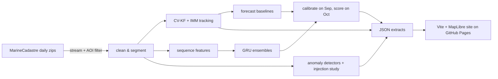

# ais-sentinel

**Maritime domain awareness from public AIS data.** ais-sentinel turns noisy, irregular ship
position broadcasts into smooth tracks with honest uncertainty. It forecasts where each
vessel will be 15–120 minutes ahead, and flags behaviour an analyst would want to review:
going dark, impossible jumps, loitering, leaving the usual lanes, and ship-to-ship meetings.

**Live site:** https://jrhughes003.github.io/ais-sentinel/

<!-- RESULTS:START -->
> Results are being regenerated on the full six-month dataset. See
> [PROGRESS.md](PROGRESS.md) for the current status.
<!-- RESULTS:END -->

## What's inside

| Pillar | Methods | Evaluated by |
|---|---|---|
| **Tracking** | Constant-velocity Kalman filter; 3-mode IMM (stationary / cruising / coordinated-turn EKF); outlier rejection against a clutter model; RTS smoothing | A simulator with known ground truth (manoeuvres, AIS-like gaps, GPS noise, outliers); NEES/NIS consistency |
| **Prediction** | Dead reckoning; KF and IMM extrapolation; kNN route analogs; GRU with Gaussian and mixture-density heads (deep ensembles) | Locked October test month; voyage-cluster bootstrap CIs; paired comparisons; calibrated 90% ellipses |
| **Anomalies** | Explainable rules (gap, jump, loiter, route deviation, rendezvous), with context learned from training data (receiver coverage, ports, lanes, headings) | Synthetic anomalies injected into real voyages: precision and recall by magnitude; base alarm rates; case studies |

**Region and period:**
- Detroit–St. Clair corridor (Port Huron → Detroit River → western Lake Erie), May–October 2023.
- About 10 M AIS reports from MarineCadastre.gov.
- Time-based splits: train May–Aug, validate Sep, **locked test Oct**, with buffer days
  so no voyage crosses a split.

## Architecture



The package uses a src layout:

| Module | Contents |
|---|---|
| `ais_sentinel.data` | download, schema, cleaning, segmentation |
| `ais_sentinel.tracking` | models, KF, IMM, simulator, simulation study |
| `ais_sentinel.prediction` | samples, baselines, kNN, features, ML, experiment |
| `ais_sentinel.anomaly` | context, detectors, injection, evaluation |
| `ais_sentinel.evaluation` | metrics and bootstrap CIs |
| `ais_sentinel.export` | site data |

The front end is in `site/`. Design rationale is in [DECISIONS.md](DECISIONS.md), and the
full plan and pre-registered targets are in [PLAN.md](PLAN.md).

## Reproduce

Windows PowerShell:

```powershell
py -3.12 -m venv .venv
.venv\Scripts\python -m pip install torch --index-url https://download.pytorch.org/whl/cpu
.venv\Scripts\python -m pip install -e ".[ml,dev]"
.venv\Scripts\ais-sentinel run-all          # download → build → sim-study → track → evaluate → anomaly → export
.venv\Scripts\ais-sentinel holdout          # locked test: deliberately NOT part of run-all
cd site; npm ci; npm run dev                # http://localhost:5173
```

On Linux/macOS, use `python3.12 -m venv .venv` and `.venv/bin/...`.

**Run times and resources:**

| What | Approximate cost |
|---|---|
| Download | ~59 GB over a few hours, one file at a time |
| Raw data on disk | Each national file is deleted after filtering; ~1.3 GB peak |
| Kept data | ~250 MB |
| Tracking + training | ~1 h on a 4-core laptop CPU; no GPU needed |

**Checks:** `ruff check .`, `mypy`, `pytest` (Python) and `npx playwright test` (site, desktop
and mobile, with axe accessibility checks).

Every threshold and hyperparameter lives in `configs/default.yaml`. `configs/dev.yaml` shows
how to run the whole pipeline on a short development window.

## Limitations

- MarineCadastre keeps at most one report per vessel per minute, so fast manoeuvres are
  undersampled.
- It covers one inland region and one season. Results may not transfer to open ocean or
  winter conditions.
- Synthetic anomalies measure how detectable the injected patterns are, not how well real
  deception is caught. Real deception is rarer and more varied.
- Coverage of the Canadian side depends on the reach of US Coast Guard receivers.
- MMSI is taken as identity. Spoofed or shared identities show up only as kinematic symptoms.
- Flags are prompts for an analyst, not accusations. Coverage holes, GPS faults and
  shared transponders explain many of them.

## Data attribution and licence

AIS data: U.S. Coast Guard Navigation Center, via NOAA Office for Coastal Management and BOEM,
[MarineCadastre.gov](https://marinecadastre.gov/) "Nationwide Automatic Identification System"
2023, released under **CC0 1.0**. The data are provided "as is" and are **not for navigation**.

Basemap: © OpenFreeMap © OpenMapTiles © OpenStreetMap contributors.

Code: [MIT](LICENSE).
