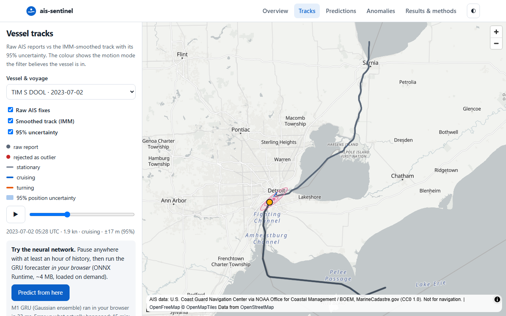
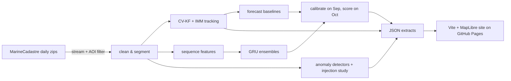

# ais-sentinel

**Maritime domain awareness from public AIS data.** ais-sentinel turns noisy, irregular ship
position broadcasts into smooth tracks with honest uncertainty. It forecasts where each
vessel will be 15–120 minutes ahead, and flags behaviour an analyst would want to review:
going dark, impossible jumps, loitering, leaving the usual lanes, and ship-to-ship meetings.

**Live site:** https://jrhughes003.github.io/ais-sentinel/

<!-- RESULTS:START -->


## Results

All results are on the **locked October 2023 test month**. It was evaluated once
([reports/holdout_runs.md](reports/holdout_runs.md)) after every model, setting and
calibration had been fixed on May–September data.

**Data:**
- 11.1 M AOI reports, cleaned to 11.09 M;
- 1,109 vessels and 24,664 usable voyages (50,235 voyages before length filters);
- 44,431 underway test forecast samples.

### Trajectory prediction: mean error (km), 95% voyage-cluster bootstrap CI

| Model | 15 min | 30 min | 60 min | 120 min |
|---|---:|---:|---:|---:|
| B0 Dead reckoning | 0.94 | 2.79 | 7.24 | 18.52 |
| B1 Kalman (CV) extrapolation | 0.99 | 2.86 | 7.31 | 18.62 |
| B2 IMM extrapolation | 1.14 | 3.13 | 7.71 | 17.68 |
| B3 Route analogs (kNN) | **0.42** | **0.97** | 2.37 | 5.76 |
| M1 GRU, Gaussian (3-member ensemble) | 0.44 | 1.01 | 2.29 | 5.50 |
| **M2 GRU, mixture (2-member ensemble)** | **0.42** | **0.97** | **2.20** [2.08, 2.33] | **5.21** [4.94, 5.47] |

Against the strongest baseline (kNN), the ML model chosen on validation (M2) is:

| Horizon | M2 vs kNN | 95% CI |
|---|---:|---|
| 15 min | +1.6% | spans 0 (a tie) |
| 30 min | +0.2% | spans 0 (a tie) |
| 60 min | **−7.1%** | [−0.24, −0.10] km |
| 120 min | **−9.5%** | [−0.78, −0.33] km |

- On vessels **never seen in training**, its lead grows to about 17% at 120 min
  (4.11 against 4.95 km).
- Its calibrated **90% ellipses contain the truth 89–91%** of the time.
- Physics baselines are roughly 3× worse beyond 30 minutes. In this region's river bends
  and ferry routes, *where vessels usually go* matters more than *how they are moving now*.

### Pre-registered success criteria (targets fixed before any results)

| Area | Criterion | Result | Met? |
|---|---|---|---|
| Data | Reproducible pipeline; DQ tests; ≥ 5 M rows | 11.09 M rows; leakage and DQ tests pass | ✅ |
| Tracking | IMM ≥ 20% lower RMSE than tuned CV-KF in manoeuvres (simulation) | CV-KF 4.5 m vs IMM 9.0 m in a simulator calibrated to real ships; medians equal (attempt 4; earlier −0.4%, −0.6%, 7.1%) | ❌ |
| Tracking | IMM no more than 10% worse on straights | +33% (7.3 vs 9.7 m; medians equal) after the post-gap restart fix (attempt 3: +5,678%) | ❌ |
| Tracking | NEES inside the 95% band for ≥ 80% of steps | 17% (attempt 3: 1%) | ❌ |
| Tracking | Real NIS: 2–10% above the 95% threshold | 1.6%, up from 0.9% after fitting noise to real data | ❌ |
| Prediction | ML beats best baseline at 60 & 120 min, ≥ 15% at 120 | significant at both, but −9.5% at 120 | ❌ |
| Prediction | 90% coverage within 85–95% at every horizon | 0.89–0.91 | ✅ |
| Anomaly | Gap P ≥ 0.9 / R ≥ 0.9 | 1.00 / 0.85 | ❌ |
| Anomaly | Jump P ≥ 0.9 / R ≥ 0.9 | 1.00 / 0.99 | ✅ |
| Anomaly | Loiter P ≥ 0.8 / R ≥ 0.8 | 1.00 / 0.96 | ✅ |
| Anomaly | Route deviation P ≥ 0.7 / R ≥ 0.7 | 1.00 / 0.47 | ❌ |
| Anomaly | Rendezvous P ≥ 0.8 / R ≥ 0.8 | 1.00 / 0.96 | ✅ |
| Anomaly | ≥ 3 real-world case studies | 4 (shared MMSI, dark transit, tug assist, fishing) | ✅ |
| Site | All views; desktop + mobile; 0 serious axe violations; ≤ 2 MB initial load | 26 Playwright tests pass | ✅ |
| Engineering | CI green; ≥ 85% coverage on core modules | 80 tests, 95% coverage | ✅ |

**Tracking had four attempts, all reported** (DECISIONS D15, D19, D20, D21). The final one fitted
the simulator and both filters to real ship behaviour.
- On real data, the IMM predicts each next fix far better than a Kalman filter (mean
  log-likelihood −7.4 against −10.4 per fix).
- In a realistic simulator, though, gentle real manoeuvres are tracked equally well by a
  well-tuned Kalman filter, so the pre-registered simulation margins are not met.

Misses are explained, not hidden. Details are in
[PROGRESS.md](PROGRESS.md#final-summary) and the reports:
[prediction](reports/prediction_test.md), [tracking](reports/tracking.md),
[anomaly](reports/anomaly.md).
<!-- RESULTS:END -->

## What's inside

| Pillar | Methods | Evaluated by |
|---|---|---|
| **Tracking** | Constant-velocity Kalman filter; 3-mode IMM (stationary / cruising / coordinated-turn EKF); outlier rejection against a clutter model; RTS smoothing | A simulator with known ground truth (manoeuvres, AIS-like gaps, GPS noise, outliers); NEES/NIS consistency |
| **Prediction** | Dead reckoning; KF and IMM extrapolation; kNN route analogs; GRU with Gaussian and mixture-density heads (deep ensembles) | Locked October test month; voyage-cluster bootstrap CIs; paired comparisons; calibrated 90% ellipses |
| **Anomalies** | Explainable rules (gap, jump, loiter, route deviation, rendezvous), with context learned from training data (receiver coverage, ports, lanes, headings) | Synthetic anomalies injected into real voyages: precision and recall by magnitude; base alarm rates; case studies |

**Region and period:**
- Detroit–St. Clair corridor (Port Huron → Detroit River → western Lake Erie), May–October 2023.
- About 10 M AIS reports from MarineCadastre.gov.
- Time-based splits: train May–Aug, validate Sep, **locked test Oct**, with buffer days
  so no voyage crosses a split.

## Architecture



The package uses a src layout:

| Module | Contents |
|---|---|
| `ais_sentinel.data` | download, schema, cleaning, segmentation |
| `ais_sentinel.tracking` | models, KF, IMM, simulator, simulation study |
| `ais_sentinel.prediction` | samples, baselines, kNN, features, ML, experiment |
| `ais_sentinel.anomaly` | context, detectors, injection, evaluation |
| `ais_sentinel.evaluation` | metrics and bootstrap CIs |
| `ais_sentinel.export` | site data |

The front end is in `site/`. The ideas beyond a standard Kalman filter are explained in
[docs/METHODS.md](docs/METHODS.md). Design rationale is in [DECISIONS.md](DECISIONS.md), and the
full plan and pre-registered targets are in [PLAN.md](PLAN.md).

## Reproduce

Windows PowerShell:

```powershell
py -3.12 -m venv .venv
.venv\Scripts\python -m pip install torch --index-url https://download.pytorch.org/whl/cpu
.venv\Scripts\python -m pip install -e ".[ml,dev]"
.venv\Scripts\ais-sentinel run-all          # download → build → sim-study → track → evaluate → anomaly → export
.venv\Scripts\ais-sentinel holdout          # locked test: deliberately NOT part of run-all
cd site; npm ci; npm run dev                # http://localhost:5173
```

On Linux/macOS, use `python3.12 -m venv .venv` and `.venv/bin/...`.

**Run times and resources:**

| What | Approximate cost |
|---|---|
| Download | ~59 GB over a few hours, one file at a time |
| Raw data on disk | Each national file is deleted after filtering; ~1.3 GB peak |
| Kept data | ~250 MB |
| Tracking + training | ~1 h on a 4-core laptop CPU; no GPU needed |

**Checks:** `ruff check .`, `mypy`, `pytest` (Python) and `npx playwright test` (site, desktop
and mobile, with axe accessibility checks).

Every threshold and hyperparameter lives in `configs/default.yaml`. `configs/dev.yaml` shows
how to run the whole pipeline on a short development window.

## Limitations

- MarineCadastre keeps at most one report per vessel per minute, so fast manoeuvres are
  undersampled.
- It covers one inland region and one season. Results may not transfer to open ocean or
  winter conditions.
- Synthetic anomalies measure how detectable the injected patterns are, not how well real
  deception is caught. Real deception is rarer and more varied.
- Coverage of the Canadian side depends on the reach of US Coast Guard receivers.
- MMSI is taken as identity. Spoofed or shared identities show up only as kinematic symptoms.
- Flags are prompts for an analyst, not accusations. Coverage holes, GPS faults and
  shared transponders explain many of them.

## Data attribution and licence

AIS data: U.S. Coast Guard Navigation Center, via NOAA Office for Coastal Management and BOEM,
[MarineCadastre.gov](https://marinecadastre.gov/) "Nationwide Automatic Identification System"
2023, released under **CC0 1.0**. The data are provided "as is" and are **not for navigation**.

Basemap: © OpenFreeMap © OpenMapTiles © OpenStreetMap contributors.

Code: [MIT](LICENSE).
