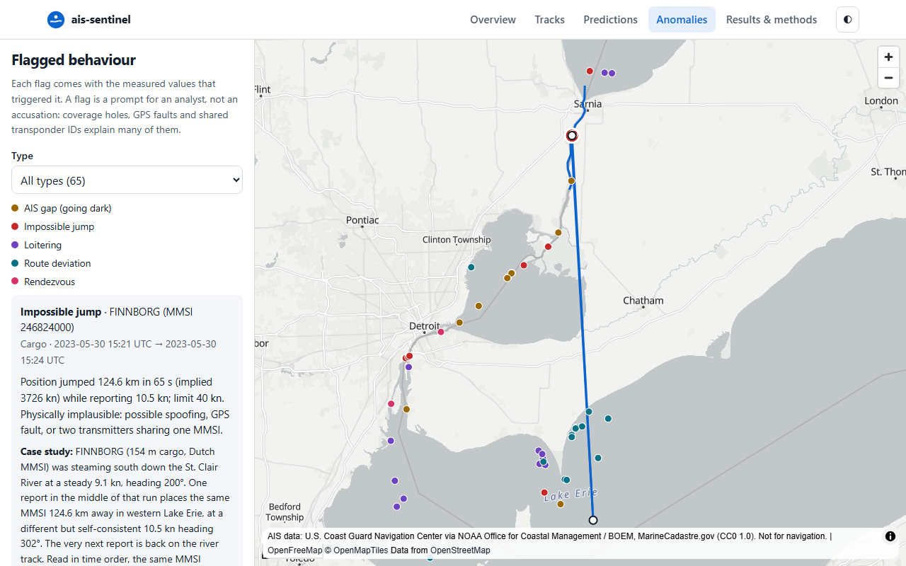

# ais-sentinel

**Ship tracking, 2-hour position forecasts with calibrated uncertainty, and anomaly
detection, built on 11 million public AIS ship-position reports.**

**Live demo:** https://jrhughes003.github.io/ais-sentinel/

Ships broadcast their position over AIS, but the data is noisy, irregular and full of gaps.
ais-sentinel takes six months of it from the Detroit–St. Clair corridor on the US–Canada
border and produces three things:
- smooth tracks for each vessel;
- forecasts of where each ship will be 15–120 minutes ahead, with an uncertainty ellipse;
- flags for behaviour an analyst would want to check: going dark, impossible jumps,
  loitering, leaving the usual lanes, and ship-to-ship meetings.

What sets it apart is the **evaluation**:
- The success targets were written down before any results existed.
- The final test month was locked away and scored exactly once.
- Missed targets are reported alongside the met ones.

The neural forecaster also runs live in the browser, and a test checks that it matches the
Python model.

**Skills demonstrated:** time-series ML (GRU, mixture-density outputs, deep ensembles) ·
uncertainty quantification and calibration · Kalman/IMM tracking · evaluation design
(pre-registration, locked test set, cluster bootstrap, synthetic injection) · ONNX
deployment to the browser · data engineering at 11 M rows · testing and CI in Python and
TypeScript.

## Key findings

- **Knowing where ships usually go beats physics.** Projecting current speed and heading
  forward is off by 7.2 km on average after an hour, and 18.5 km after two. Looking up
  where past ships at the same spot went next is off by 2.4 and 5.8 km.
- **The ML model is modestly better than that history-based baseline, at longer
  horizons only.** Its error is 7.1% lower at 60 minutes and 9.5% lower at 120, and both
  gaps are statistically significant. At 15–30 minutes the two are tied. On ships it never
  saw in training, the 2-hour gap grows to about 17%.
- **Its uncertainty estimates are well calibrated.** When it says "90% sure the ship will
  be inside this ellipse", the ship is there 89–91% of the time.
- **The more complex tracker did not beat a well-tuned simple one in simulation.** The
  3-mode IMM filter fits real ship data much better than a constant-velocity Kalman filter.
  But in a simulator matched to real ships, the simple filter was at least as accurate. All
  four attempts are reported.
- **The anomaly detectors are precise, but two of them miss too much.** On anomalies
  injected into real voyages, jumps, loitering and meetings are caught 96–99% of the time,
  with no false alarms on those voyages. Going dark is caught 85% of the time, and route
  deviation 47%.

## Headline results

These results are all on the **locked October 2023 test month**. It was evaluated once,
after every model and setting had been fixed on May–September data
([run log](reports/holdout_runs.md)). Error is the mean distance between the forecast and
the actual position. Lower is better.

| Model | 60 min | 120 min |
|---|---:|---:|
| Dead reckoning (physics) | 7.24 km | 18.52 km |
| Route analogs: where past ships went (strongest baseline) | 2.37 km | 5.76 km |
| **GRU with mixture output (ML, chosen on validation)** | **2.20 km** | **5.21 km** |
| ML error reduction vs route analogs [95% CI, km] | 7.1% [0.10, 0.24] | 9.5% [0.33, 0.78] |

- **90% ellipse coverage:** 0.91, 0.91, 0.90 and 0.89 at 15, 30, 60 and 120 min.
- **Data:** 11.1 M reports, 1,109 vessels and 24,664 usable voyages. The test month has
  44,431 forecast samples.
- **Full tables** for all six models, all four horizons, unseen vessels, tracking and
  anomalies are in **[docs/RESULTS.md](docs/RESULTS.md)**.

## What it does

| Part | Methods | Evaluated by |
|---|---|---|
| **Tracking** | Constant-velocity Kalman filter; 3-mode IMM (stopped / cruising / turning); outlier rejection; smoothing | A simulator with known ground truth, fitted to real ship behaviour; NEES/NIS consistency on simulated and real data |
| **Prediction** | Dead reckoning; Kalman and IMM extrapolation; nearest-neighbour route analogs; GRU ensembles with Gaussian and mixture-density outputs | Locked test month; voyage-level bootstrap CIs; paired comparisons; calibrated 90% ellipses |
| **Anomalies** | Explainable rules (gap, jump, loiter, route deviation, rendezvous), with context learned from training data (receiver coverage, ports, lanes) | Synthetic anomalies injected into real voyages; base alarm rates; real case studies |

**Engineering:**
- 88 Python tests at 91% line coverage.
- 27 Playwright browser tests at desktop and mobile widths. They include axe accessibility
  checks and a check that the in-browser model matches Python (largest gap 2.6 mm).
- ruff, mypy and GitHub Actions CI. The static site deploys to GitHub Pages.

**More detail:**
- [docs/METHODS.md](docs/METHODS.md): the methods beyond a standard Kalman filter.
- [docs/REPRODUCE.md](docs/REPRODUCE.md): how to reproduce it, the pipeline diagram, the
  code layout and run times.

## Pre-registered success criteria

These targets were fixed in [PLAN.md](PLAN.md) before any results were seen, so misses are
reported as misses rather than the targets being moved. 4 of the 11 model-performance
targets were met.

| Area | Criterion | Result | Met? |
|---|---|---|---|
| Data | Reproducible pipeline; data-quality tests; ≥ 5 M rows | 11.09 M rows; leakage and data-quality tests pass | ✅ |
| Tracking | IMM ≥ 20% lower error than a tuned Kalman filter in manoeuvres (simulation) | IMM 9.0 m vs Kalman 4.5 m RMSE (IMM worse); medians equal | ❌ |
| Tracking | IMM at most 10% worse on straight legs (simulation) | IMM 9.7 m vs Kalman 7.3 m RMSE (33% worse); medians equal | ❌ |
| Tracking | Filter's stated uncertainty consistent (NEES in the 95% band) on ≥ 80% of steps | 17%, up from 1% | ❌ |
| Tracking | On real data, 2–10% of NIS values above the 95% threshold | 1.6% (attempt 3), up from 0.9%; attempt-4 value pending | ❌ |
| Prediction | ML beats the best baseline at 60 and 120 min, by ≥ 15% at 120 | Significant at both, but 9.5% at 120 | ❌ |
| Prediction | 90% ellipses contain the truth 85–95% of the time at every horizon | 89–91% | ✅ |
| Anomaly | Gap precision ≥ 0.9, recall ≥ 0.9 | 1.00 / 0.85 | ❌ |
| Anomaly | Jump precision ≥ 0.9, recall ≥ 0.9 | 1.00 / 0.99 | ✅ |
| Anomaly | Loiter precision ≥ 0.8, recall ≥ 0.8 | 1.00 / 0.96 | ✅ |
| Anomaly | Route deviation precision ≥ 0.7, recall ≥ 0.7 | 1.00 / 0.47 | ❌ |
| Anomaly | Rendezvous precision ≥ 0.8, recall ≥ 0.8 | 1.00 / 0.96 | ✅ |
| Anomaly | ≥ 3 real-world case studies | 4 (shared MMSI, dark transit, tug assist, fishing) | ✅ |
| Site | All views; desktop + mobile; 0 serious axe violations; ≤ 2 MB initial load | Met; one keyboard-navigation test is intermittently flaky | ✅ |
| Engineering | CI green; ≥ 85% coverage on core modules | 91% coverage; CI red on the latest commit from one stale test assertion | ⚠️ |

Why each miss happened, and what was tried, is in [docs/RESULTS.md](docs/RESULTS.md) and
[DECISIONS.md](DECISIONS.md) (D15, D18–D21).

**Next:** a v2 evaluation on a fresh test month (October 2024) is set up but has not been run
yet. Any changed model or detector will be scored there, not on October 2023.

## How this was built

I built this project with **Claude Code**, Anthropic's AI coding agent, and every commit
credits it as co-author. Claude Code wrote most of the code, tests and documentation. I set
the direction and made the decisions that determine whether the results mean anything:
- **Scope:** the region, the time window, and the three parts.
- **Evaluation design:**
  - time-based splits with buffers;
  - a vessel-unseen subset;
  - voyage-level confidence intervals.
- **Pre-registration** of the success targets before any results.
- **The locked test month:** October 2023 was run once and logged. Later fixes wait for a
  new month.
- **Which results to accept:**
  - a bounded number of tracking attempts, with the fourth approved as a logged exception;
  - reporting the latest attempt rather than the best;
  - choosing the anomaly detectors' operating point;
  - publishing the misses.

The reasoning is recorded in [DECISIONS.md](DECISIONS.md) and the working log in
[PROGRESS.md](PROGRESS.md).

## Limitations

- The source keeps at most one report per vessel per minute, and the data covers one
  inland region and one season. The results may not transfer to open ocean or winter.
- Synthetic anomalies measure how detectable the injected patterns are, not how well real
  deception is caught. Flags are prompts for an analyst, not accusations.

## Data attribution and licence

AIS data: U.S. Coast Guard Navigation Center, via NOAA Office for Coastal Management and BOEM,
[MarineCadastre.gov](https://marinecadastre.gov/) "Nationwide Automatic Identification System"
2023, released under **CC0 1.0**. The data are provided "as is" and are **not for navigation**.
Basemap: © OpenFreeMap © OpenMapTiles © OpenStreetMap contributors. Code: [MIT](LICENSE).
