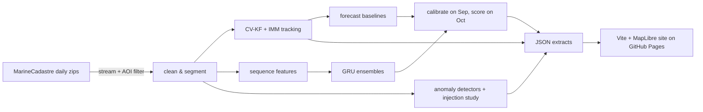

# Reproducing the results and code layout

## Run it

Windows PowerShell:

```powershell
py -3.12 -m venv .venv
.venv\Scripts\python -m pip install torch --index-url https://download.pytorch.org/whl/cpu
.venv\Scripts\python -m pip install -e ".[ml,dev]"
.venv\Scripts\ais-sentinel run-all          # download → build → sim-study → track → evaluate → anomaly → export
.venv\Scripts\ais-sentinel holdout          # locked test: deliberately NOT part of run-all
cd site; npm ci; npm run dev                # http://localhost:5173
```

On Linux/macOS, use `python3.12 -m venv .venv` and `.venv/bin/...`.

Every threshold and hyperparameter lives in `configs/default.yaml`. `configs/dev.yaml` shows
how to run the whole pipeline on a short development window. `configs/v2.yaml` holds the
fresh-test-month (October 2024) setup.

## Run times and resources

| What | Approximate cost |
|---|---|
| Download | ~59 GB over a few hours, one file at a time |
| Raw data on disk | Each national file is deleted after filtering; ~1.3 GB peak |
| Kept data | ~250 MB |
| Tracking | ~34 min for 11.0 M fixes on a 4-core laptop CPU |
| Prediction (evaluate stage, incl. GRU ensembles) | ~3.5 h on the same CPU; no GPU needed |

## Checks

- Python: `ruff check .`, `ruff format --check .`, `mypy`, `pytest`.
- Site: `npm run build`, then `npx playwright test`. This runs the browser tests at desktop
  and mobile widths, with axe accessibility checks, a page-weight check, and a parity check
  that the in-browser ONNX model matches Python.

Both run in GitHub Actions ([.github/workflows](../.github/workflows)). The site is deployed
to GitHub Pages from `main`.

## Code layout



The package uses a src layout:

| Module | Contents |
|---|---|
| `ais_sentinel.data` | download, schema, cleaning, segmentation |
| `ais_sentinel.tracking` | models, KF, IMM, simulator, simulation study, real-data calibration |
| `ais_sentinel.prediction` | samples, baselines, kNN, features, ML, experiment |
| `ais_sentinel.anomaly` | context, detectors, injection, evaluation, tuning |
| `ais_sentinel.evaluation` | metrics and bootstrap CIs |
| `ais_sentinel.export` | site data and ONNX export |

The front end is in `site/` (Vite, TypeScript, MapLibre GL, Observable Plot, onnxruntime-web).

## Further reading

- [METHODS.md](METHODS.md): the ideas beyond a standard Kalman filter (IMM, clutter test,
  NEES/NIS, kNN analogs, GRU with mixture heads, calibration, cluster bootstrap, injection
  testing).
- [RESEARCH.md](RESEARCH.md): data source, formats and literature notes.
- [../PLAN.md](../PLAN.md): the full plan and the pre-registered targets.
- [../DECISIONS.md](../DECISIONS.md): design decisions, numbered D1–D21.
